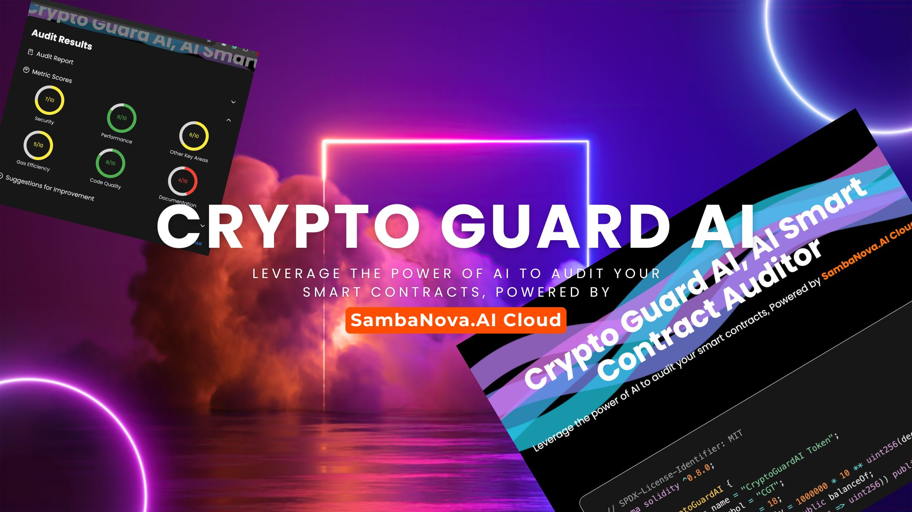

---

## 📋 Table of Contents

1. 🔎 [Background](#background)  
2. 🤔 [Problem Statement](#problem_statement)   
3. 🤖 [Introduction](#introduction)  
4. 🔋 [Features](#features)  
5. ⚙️ [Architecture](#architecture) 

## 🔎 Background

I am a blockchain developer and an AI enthusiast with an academic background in Artificial Intelligence. With the surge in cryptocurrency adoption and advancements in AI—such as the emergence of large language models (LLMs) and multimodal LLMs—I have observed a unique intersection of these technologies. This inspired the creation of **CryptoGuardAI**, a tool designed to address a pressing issue in the blockchain ecosystem.

## 🤔 Problem Statement

As the cryptocurrency market grows, with Ethereum and other digital assets experiencing unprecedented surges, the volume and complexity of smart contracts deployed have increased. However, the decentralized nature of blockchain also leaves it vulnerable to malicious contracts, coding errors, and security breaches, which can result in devastating financial losses.

Current smart contract auditing methods are often manual, time-intensive, and require deep domain expertise. Additionally, they struggle to keep pace with the rapid deployment of decentralized applications (DApps). Meanwhile, the rise of advanced AI models like LLMs presents an opportunity to revolutionize how we approach smart contract analysis and security.

**CryptoGuardAI** bridges this gap by combining blockchain expertise with the power of AI to create an automated, efficient, and reliable auditing solution for smart contracts. 

## 🤖 Introduction

**CryptoGuardAI** is a cutting-edge solution for smart contract auditing powered by AI. By integrating SambaNova.AI's advanced APIs with blockchain technology, the platform offers a robust, automated tool for analyzing and securing smart contracts. Its goal is to simplify the auditing process, enhance security, and protect the growing decentralized economy.

## 🔋 Features

- **AI-Driven Smart Contract Analysis**: Leverages the power of SambaNova.AI Cloud to identify vulnerabilities, optimize code, and ensure compliance with industry standards.  
- **Command-Line Integration**: A CLI tool, `crypto-guard-ai`, for seamless integration into developer pipelines.  
- **Interactive User Interface**: A React-based frontend for users who prefer an accessible, visual approach to smart contract auditing.  
- **Real-Time Insights**: Provides instant feedback and detailed reports on smart contract code, reducing time-to-market for projects.  

## ⚙️ Architecture

1. **Command Line Tool**: `crypto-guard-ai` enables developers to run contract audits directly from their terminal.  
2. **Frontend**: A React-based user interface designed for accessibility and ease of use.  
3. **API Integration**: Deep integration with the SambaNova.AI Cloud API for processing and analyzing smart contracts.  

---

By blending blockchain development with the latest AI advancements, **CryptoGuardAI** aims to safeguard the decentralized world with smarter, faster, and more reliable contract audits.